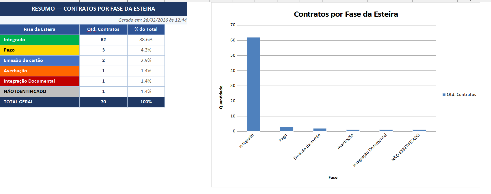

# Automação para Validação de Documentação Regulatória no Crédito Consignado

> Uma abordagem orientada à Governança e Compliance

**Autora:** Daiane Vinharski  
**Área:** Produtos Financeiros — Crédito Consignado  
**Data:** Fevereiro de 2026

---

## 📋 Sumário

- [Resumo](#resumo)
- [Contextualização do Problema](#contextualização-do-problema)
- [Justificativa](#justificativa)
- [Solução Desenvolvida](#solução-desenvolvida)
- [Resultados](#resultados)
- [Contribuições para Governança e Compliance](#contribuições-para-a-governança-e-o-compliance)
- [Como Utilizar](#como-utilizar)
- [Considerações Finais](#considerações-finais)
- [Referências](#referências)

---

## Resumo

O presente artigo descreve o desenvolvimento de uma solução de automação voltada à validação de documentação regulatória no segmento de crédito consignado. A ferramenta foi desenvolvida em Python e tem como finalidade monitorar o cumprimento do prazo de envio de documentos ao órgão gestor tecnológico dos contratos consignados, garantindo aderência às normativas vigentes.

O projeto integra leitura de arquivos compactados, automação de consultas via web scraping e geração de relatórios estruturados em Excel, com suporte à tomada de decisão operacional e à gestão de pendências. Os resultados demonstram que a solução contribui para o fortalecimento da governança interna, a identificação proativa de falhas no fluxo operacional e o cumprimento de exigências regulatórias.

**Palavras-chave:** automação · crédito consignado · compliance · governança · Python · web scraping · INSS · documentação regulatória

---

## Contextualização do Problema

### O Fluxo Operacional do Contrato Consignado

A contratação de um produto consignado — como o cartão consignado — percorre diversas etapas dentro do sistema da instituição financeira, organizadas em uma esteira de processamento. Cada fase representa um marco do contrato: desde a formalização, passando pela análise de crédito, pela averbação junto ao órgão pagador, até a **Integração Documental**, que corresponde ao envio dos documentos ao órgão competente.

A fase de Integração Documental é a etapa final do fluxo e a mais crítica sob a ótica regulatória. É nessa fase que um sistema de OCR lê as informações do contrato, extrai os dados relevantes e realiza o envio eletrônico da documentação ao órgão gestor. **O prazo começa a contar a partir da data de averbação do contrato.**

### O Arquivo de Monitoramento

O órgão responsável pela gestão tecnológica dos contratos disponibiliza, de forma **quinzenal**, um arquivo `.csv.gz` contendo a relação de contratos que ainda não tiveram sua documentação enviada. Antes da automação, essa análise era feita manualmente — contrato por contrato — um processo moroso, sujeito a erros e sem visão consolidada das pendências.

---

## Justificativa

Trabalhar com órgãos federais exige o cumprimento rigoroso de normativas. O descumprimento de prazos pode representar penalidades regulatórias e comprometer a relação com o órgão. Um fluxo bem estruturado permite identificar com precisão:

- **Em qual etapa** ocorreu a falha
- **Qual área** é responsável pela correção
- **Quanto tempo** se passou desde o evento que disparou o prazo

Isso está diretamente alinhado aos pilares de **Governança Corporativa e Compliance**: transparência, responsabilização, conformidade e rastreabilidade.

---

## Solução Desenvolvida

### Visão Geral

A solução foi desenvolvida em **Python** e estruturada em três etapas:

```
Arquivo .csv.gz  →  Web Scraping (Selenium)  →  Relatório Excel
   (DATAPREV)          (Sistema Interno)         (3 abas)
```

### Tecnologias utilizadas

| Tecnologia | Finalidade |
|-----------|-----------|
| Python 3 | Linguagem principal |
| pandas | Leitura e processamento do arquivo .csv.gz |
| Selenium | Automação de consultas no sistema interno |
| openpyxl | Geração do relatório Excel formatado |

### Etapa 1 — Leitura do Arquivo Regulatório

Lê o `.csv.gz` disponibilizado pelo órgão via `pandas` (com fallback para `gzip` direto), extrai apenas os valores numéricos correspondentes aos contratos, remove duplicatas e descarta cabeçalhos inválidos.

### Etapa 2 — Consulta Automatizada ao Sistema Interno

Para cada contrato, acessa o sistema interno via Selenium e coleta:
- **Fase atual da esteira** (ex.: Integrado, Averbação, Integração Documental)
- **Data de averbação** — marco zero do prazo regulatório
- **Dias decorridos** desde a averbação

A cada 10 contratos, um relatório parcial é salvo automaticamente como mecanismo de segurança.

### Etapa 3 — Relatório Excel Estruturado

O relatório é gerado com três abas:

| Aba | Conteúdo |
|-----|---------|
| **Relatório** | Detalhamento por contrato com colorização por fase e por tempo decorrido |
| **Resumo** | Contagem por fase com percentual e gráfico de barras |
| **Pendências** | Contratos que requerem atenção, com motivo e área responsável |

---

## Resultados

### Aba Relatório


### Aba Resumo



### Aba Pendências


---

Em uma execução realizada em fevereiro de 2026, a ferramenta processou **70 contratos**, com os seguintes resultados:

| Fase da Esteira | Qtd. Contratos | % do Total |
|----------------|:--------------:|:----------:|
| Integrado | 62 | 88,6% |
| Pago | 3 | 4,3% |
| Emissão de Cartão | 2 | 2,9% |
| Averbação | 1 | 1,4% |
| Integração Documental | 1 | 1,4% |
| Não Identificado | 1 | 1,4% |
| **Total** | **70** | **100%** |

**93% dos contratos** já estavam em situação de conclusão. Os **5 contratos pendentes** foram identificados com motivo e fase, permitindo tratativa imediata. A coluna de dias revelou casos com até **78 dias de atraso** — dado invisível sem a automação.

---

## Contribuições para a Governança e o Compliance

- **Rastreabilidade** — cada execução gera evidência datada do monitoramento realizado
- **Responsabilização** — o relatório aponta em qual fase está a falha e direciona a correção
- **Melhoria contínua** — dados agregados permitem identificar gargalos no fluxo
- **Conformidade regulatória** — acompanhamento sistemático a cada quinzena, eliminando o risco de surpresas no prazo

---

## Como Utilizar

### Pré-requisitos

```bash
pip install pandas selenium openpyxl
```

Também é necessário o **msedgedriver** compatível com a versão do Microsoft Edge instalada.  
Download: https://developer.microsoft.com/en-us/microsoft-edge/tools/webdriver/

### Configuração

No início do arquivo `automacao_dataprev.py`, ajuste as variáveis de configuração:

```python
ARQUIVO_GZ    = r"C:\caminho\para\arquivo.csv.gz"   # arquivo do órgão
ARQUIVO_SAIDA = r"C:\caminho\para\Relatorio.xlsx"    # onde salvar o relatório
DRIVER_PATH   = r"C:\caminho\para\msedgedriver.exe"  # driver do Edge
URL_SISTEMA   = "https://seu-sistema-interno.com"    # URL do sistema
```

Para as credenciais, utilize **variáveis de ambiente** (recomendado):

```bash
# Windows (PowerShell)
$env:SISTEMA_USER = "seu_usuario"
$env:SISTEMA_PASS = "sua_senha"
```

### Execução

```bash
python automacao_dataprev.py
```

---

## Considerações Finais

A automação demonstra que é possível, com ferramentas acessíveis como Python e Selenium, criar soluções que vão além da eficiência operacional e contribuem para o fortalecimento dos mecanismos de governança e compliance de uma instituição financeira.

Como próximos passos, pretende-se evoluir a solução para execução agendada e automática, além de incorporar alertas para contratos próximos do vencimento do prazo.

---

## Referências

- BRASIL. Instrução Normativa INSS/PRES nº 28/2008 e atualizações.
- IBGC. Código das Melhores Práticas de Governança Corporativa. 5. ed. São Paulo: IBGC, 2015.
- PYTHON SOFTWARE FOUNDATION. Python 3 Documentation. https://docs.python.org/3/
- SELENIUM. WebDriver Documentation. https://www.selenium.dev/documentation/

---

*Projeto desenvolvido com base em contexto profissional real. Dados sensíveis anonimizados para fins de publicação.*
